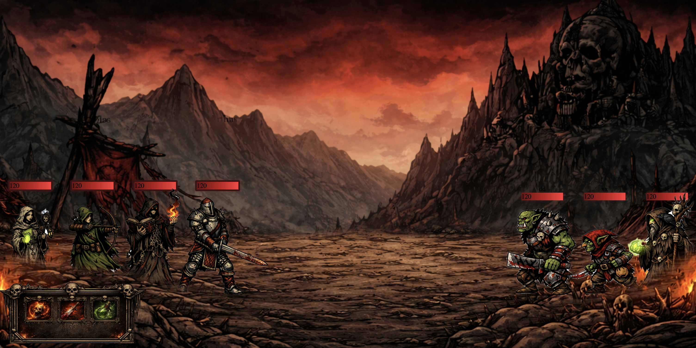

# ⚔️ Turn-Based RPG

A browser-based turn-based RPG built with **vanilla JavaScript** — no frameworks, no dependencies. Raw DOM manipulation, smooth combat animations, and classic RPG turn system.

---

## 🎮 How to Play

1. Click **⚔️ Attack** — then click an enemy to strike
2. Click **💚 Heal** — then click a wounded ally to restore 20 HP
3. Survive the enemy's counter-attack
4. Defeat all enemies to win

---

## ✨ Features

- **Turn-based combat** with a phase state machine (`chooseEnemy → playerTurn → playerAttacking → enemyTurn → enemyAttacking`)
- **Smooth animations** — characters slide toward each other on attack using `getBoundingClientRect()` + CSS transitions
- **Attack sprites** — characters swap images during attack animations
- **Sound effects** — unique audio per character class (sword, arrow, dagger, spells)
- **HP bars** — animated health bars with smooth fill transitions
- **Party of 4** — Warrior, Mage, Archer, Healer each with unique attack sounds
- **3 enemies** — Orc, Goblin, Druid each with their own attack animations
- **Hash-based routing** — SPA navigation without any router library
- **Win/Lose screens** — automatic redirect when all enemies or all heroes fall

---

## 🧱 Project Structure

```
├── index.html
├── index.js
├── router.js
├── characters/
│   ├── characters.js        # Character class
│   ├── characters_list.js   # Party definitions
│   └── ui.js                # DOM creation for heroes
├── enemies/
│   ├── enemies.js           # Enemy class
│   ├── enemies_list.js      # Enemy definitions
│   └── ui_enemies.js        # DOM creation for enemies
├── fightLogic/
│   ├── gameManager.js       # Game state, turn logic, attack/heal functions
│   └── gameMenagerUi.js     # Button & click event listeners
├── fightBattleUI/
│   └── fightBattleUi.js     # Attack/heal animations, phase effects
├── turnLogic/
│   └── turnLogic.js         # Turn manager — routes phases to actions
└── soundsEffects/
    └── charactersSounds.js  # Audio playback
```

---

## 🔧 Tech Stack

- **Vanilla JavaScript** (ES Modules)
- **HTML5 / CSS3**
- No build tools, no bundler, no framework

---

## 🚀 Run Locally

```bash
git clone https://github.com/KasperZaw/turn-based-game.git
cd turn-based-game
```

Open `index.html` with a local server (e.g. VS Code Live Server or):

```bash
npx serve .
```

> ⚠️ Must be served over HTTP — ES Modules don't work with `file://`

---

## 🗺️ Game Flow

```
Menu → Map → Game
              ↓
        chooseEnemy
              ↓
  [Attack] → select enemy → playerAttacking → enemyTurn → enemyAttacking
  [Heal]   → select hero  → playerHeal → playerHealAnimation → enemyTurn
              ↓
   all enemies dead? → #winner
   all heroes dead?  → #loser
```

---

## 👾 Characters

| Name | Class | HP | DMG | Sound |
|------|-------|----|-----|-------|
| Arthas | Warrior | 120 | 15 | Sword |
| Legolas | Archer | 120 | 15 | Arrow |
| Cintri | Mage | 120 | 15 | Fire Spell |
| Arthas | Healer | 120 | 15 | Healer Spell |

## 🐉 Enemies

| Class | HP | DMG | Sound |
|-------|----|-----|-------|
| Orc | 120 | 30 | Sword |
| Goblin | 120 | 30 | Dagger |
| Druid | 120 | 30 | Druid Spell |


## Game Screen

